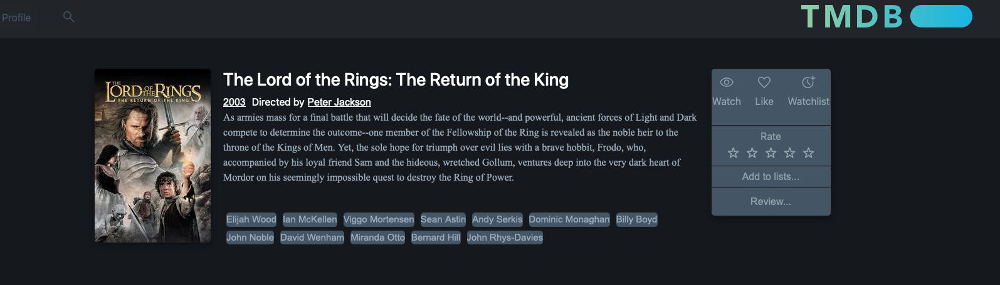

# 🎬 Movie Search App

A minimalist, Letterboxd-style movie search and review platform built with Python. This app allows users to search movies, view details, and write reviews using data from [The Movie Database (TMDb) API](https://www.themoviedb.org/documentation/api).

Everything is packaged in a Docker container for quick and consistent deployment.

---

## 📺 Demo

> 👉 **Live Demo:** [https://lukasjojo98.pythonanywhere.com/](https://lukasjojo98.pythonanywhere.com/)  
> 

---

## ✨ Features

- 🔍 Search movies via the TMDb API
- 📝 Add and view user reviews
- ⭐ Rate and comment on films
- 📦 Dockerized for easy deployment
- 🖥️ Clean and simple UI (customizable)

---

## 📦 Tech Stack

- **Python 3.11**
- **TMDb API**
- **Flask**
- **Docker**
- **OpenJDK 17**

---

## 🧪 Prerequisites

- [Docker](https://www.docker.com/)
- [TMDb API Key](https://www.themoviedb.org/settings/api)

> ⚠️ You’ll need to set your TMDb API key in a `.env` file or pass it as an environment variable when running the app.

---

## 🔐 .env Configuration

Create a file named `.env` in the project root with the following content:

```env
TMDB_API_KEY=your_tmdb_api_key_here
MOVIE_DB=filepath_to_movie_database
```

## 🚀 Getting Started

### 🔧 1. Clone the repository

```bash
git clone https://github.com/lukasjojo98/Movie-Search
cd Movie-Search
```

### 2. Run project
```bash
./run.sh
```